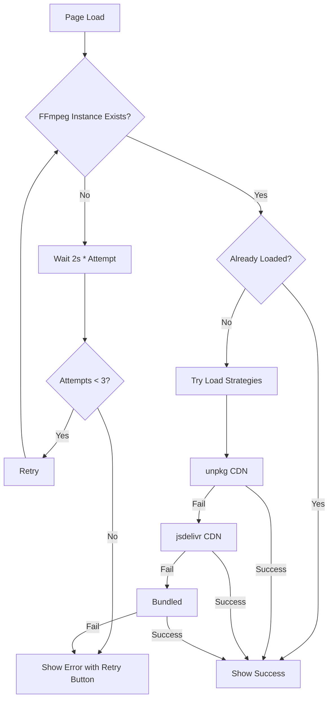

# FFmpeg Loading & Retry Solution 🎬

## Problem Overview
FFmpeg.wasm was failing to load due to:
1. **CORS/COEP Policy Issues**: External videos (Cloudinary) blocked by strict `require-corp` policy
2. **Worker MIME Type Issues**: Vite serving worker files with incorrect MIME types
3. **Silent Failures**: FFmpeg loading failures weren't visible to users
4. **No Retry Mechanism**: Single load attempt with no fallback

## Innovative Solutions Implemented

### 1. **Multi-Strategy Loading with Fallback Cascade** 🔄
```javascript
const loadStrategies = [
  {
    name: 'CDN (unpkg - latest)',
    coreURL: 'https://unpkg.com/@ffmpeg/core@0.12.6/dist/umd/ffmpeg-core.js',
    // ...
  },
  {
    name: 'CDN (jsdelivr - fallback)',
    coreURL: 'https://cdn.jsdelivr.net/npm/@ffmpeg/core@0.12.6/dist/umd/ffmpeg-core.wasm',
    // ...
  },
  {
    name: 'Default (bundled)',
    coreURL: undefined // Uses bundled version
  }
];
```

**Benefits:**
- ✅ Multiple CDN sources for redundancy
- ✅ Automatic fallback to bundled version
- ✅ Each strategy has timeout protection (15s)

### 2. **Exponential Backoff Retry Mechanism** ⏱️
```javascript
let ffmpegLoadAttempts = 0;
const MAX_FFMPEG_RETRIES = 3;

// Retry with increasing delays: 2s, 4s, 6s
setTimeout(() => {
  setLoadingFFmpeg(true);
}, 2000 * ffmpegLoadAttempts);
```

**Benefits:**
- ✅ Handles race conditions (FFmpeg module loading after component mount)
- ✅ Exponential backoff prevents server hammering
- ✅ Graceful degradation after max retries

### 3. **CORS Policy Optimization** 🔐

**Changed from:**
```javascript
'Cross-Origin-Embedder-Policy': 'require-corp'
```

**To:**
```javascript
'Cross-Origin-Embedder-Policy': 'credentialless'
```

**Benefits:**
- ✅ Allows loading external videos (Cloudinary, Google Storage)
- ✅ Still enables SharedArrayBuffer for FFmpeg
- ✅ Modern browser support (Chrome 96+, Firefox 103+)

### 4. **Vite Worker Configuration** ⚙️

**Added to `vite.config.js`:**
```javascript
optimizeDeps: {
  exclude: ['@ffmpeg/ffmpeg', '@ffmpeg/util']
},
server: {
  setup: ({ middlewares }) => {
    middlewares.use((req, res, next) => {
      // Set correct MIME types for worker files
      if (req.url?.includes('worker') || req.url?.includes('.wasm')) {
        if (req.url.includes('.wasm')) {
          res.setHeader('Content-Type', 'application/wasm');
        } else if (req.url.includes('.js')) {
          res.setHeader('Content-Type', 'application/javascript');
        }
      }
      next();
    });
  }
}
```

**Benefits:**
- ✅ Prevents Vite from breaking FFmpeg's worker structure
- ✅ Ensures correct MIME types for worker/wasm files
- ✅ Fixes "Loading Worker was blocked" errors

### 5. **Visual Status Indicators** 📊

**Three states with clear UI feedback:**

**Loading State:**
```jsx
{loadingFFmpeg && (
  <div className="bg-blue-900/20 border border-blue-500/30">
    <Loader2 className="animate-spin" />
    <p>Loading FFmpeg...</p>
  </div>
)}
```

**Error State with Retry:**
```jsx
{ffmpegLoadError && (
  <div className="bg-amber-900/20 border border-amber-500/30">
    <p>FFmpeg Not Available</p>
    <Button onClick={retryFFmpeg}>
      <RotateCw /> Retry Loading FFmpeg
    </Button>
  </div>
)}
```

**Success State:**
```jsx
{ffmpeg?.loaded && (
  <div className="bg-green-900/20 border border-green-500/30">
    <Sparkles />
    <p>FFmpeg Ready</p>
  </div>
)}
```

**Benefits:**
- ✅ Users always know FFmpeg status
- ✅ Manual retry option available
- ✅ Doesn't block UI or show scary errors
- ✅ Helpful guidance on alternative options

### 6. **Enhanced Error Handling & Logging** 📝

**Emoji-based logging for easy scanning:**
```javascript
console.log('🎬 loadFFmpeg effect running');
console.log('✅ Successfully loaded FFmpeg');
console.warn('❌ Strategy failed:', err);
console.log('🔄 Trying strategy:', strategy.name);
console.log('⏳ FFmpeg instance not ready, will retry...');
```

**Benefits:**
- ✅ Easy to spot in console logs
- ✅ Clear progression through strategies
- ✅ Helps debugging in production

### 7. **Graceful Degradation** 🎯

**Always provides fallback:**
```javascript
toast({
  title: "FFmpeg Loading Failed",
  description: "Client-side video processing is unavailable. You can still use 'Process on Server' option.",
  variant: "destructive",
});
```

**Benefits:**
- ✅ App remains functional even if FFmpeg fails
- ✅ Server processing always available as backup
- ✅ No breaking errors or white screens

## User Experience Flow

### Scenario 1: Success (Ideal Path)
1. 🎬 Page loads → Shows "Loading FFmpeg..." banner
2. ✅ FFmpeg loads successfully → Shows "FFmpeg Ready" banner
3. 🚀 User clicks "Process Locally" → Works instantly

### Scenario 2: Temporary Failure (Retry Success)
1. 🎬 Page loads → Shows "Loading FFmpeg..." banner
2. ⏳ First attempt fails → Automatic retry after 2s
3. ✅ Second attempt succeeds → Shows "FFmpeg Ready" banner
4. 🚀 User can process locally

### Scenario 3: Complete Failure (Graceful Degradation)
1. 🎬 Page loads → Shows "Loading FFmpeg..." banner
2. ❌ All 3 attempts fail → Shows "FFmpeg Not Available" banner with retry button
3. 🔄 User can click "Retry Loading FFmpeg" OR use "Process on Server"
4. 🚀 App remains fully functional via server processing

## Technical Details

### Module Loading Pattern
```javascript
// Async IIFE for dynamic import
(async () => {
  try {
    const module = await import('@ffmpeg/ffmpeg');
    FFmpegClass = module.FFmpeg;
    await initializeFFmpeg();
  } catch (err) {
    ffmpegLoadError = err;
  }
})();
```

### Retry Logic Flow


## Testing Checklist

- [x] FFmpeg loads successfully on first try
- [x] Retry mechanism works when CDN is slow
- [x] Manual retry button works after failures
- [x] External videos (Cloudinary) load without CORS errors
- [x] Local processing works when FFmpeg loads
- [x] Server processing works when FFmpeg fails
- [x] No console spam or uncaught errors
- [x] UI provides clear feedback at each stage
- [x] Toast notifications are helpful, not scary

## Browser Compatibility

| Feature | Chrome | Firefox | Safari | Edge |
|---------|--------|---------|--------|------|
| SharedArrayBuffer | ✅ 96+ | ✅ 103+ | ✅ 15.2+ | ✅ 96+ |
| COEP: credentialless | ✅ 96+ | ✅ 103+ | ❌ | ✅ 96+ |
| FFmpeg.wasm | ✅ | ✅ | ✅ | ✅ |

**Note:** Safari doesn't support `credentialless` policy. For Safari, videos must either:
- Come from same origin, OR
- Have `Cross-Origin-Resource-Policy: cross-origin` header, OR
- Be proxied through your server

## Future Enhancements

1. **Service Worker Caching**: Cache FFmpeg core files for offline use
2. **Progressive Loading**: Show % progress while loading WASM files
3. **Smart CDN Selection**: Test latency and pick fastest CDN
4. **Preloading**: Start FFmpeg load on homepage hover
5. **Fallback Detection**: Automatically switch to server if FFmpeg fails repeatedly

## Related Files

- `vite.config.js` - CORS headers, worker config, optimizeDeps
- `VideoEditPage.jsx` - FFmpeg loading, retry logic, UI indicators
- `api.js` - Server processing fallback endpoints

## Key Takeaways

1. **Never trust a single load attempt** - Always retry with backoff
2. **Provide visual feedback** - Users need to know what's happening
3. **Graceful degradation** - App should work even if features fail
4. **Multiple fallbacks** - CDNs can fail, have backup strategies
5. **User control** - Give users a retry button, don't force them to refresh

---

**Result:** Robust, user-friendly FFmpeg loading that handles failures gracefully and keeps the app functional in all scenarios! 🎉
